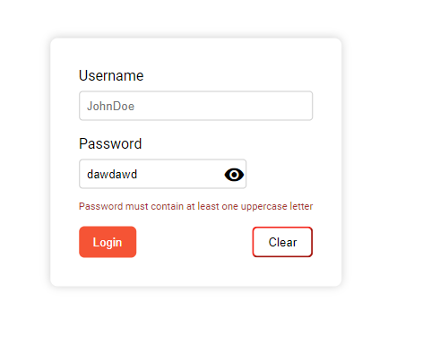

# RxJS x Signals Todos App

## Overview

A small scale implementation of combining RxJS with Signals for forms. 

- Get the form value from signal query viewchild
- Pass the real-time form value into a validator (zod) by converting the signal query into an observable
- Extract out the validation messages in terms of priority
- Handle the form value with the signal form

## Validation Example

```ts
import z from 'zod';

export const loginFormValidation = z.object({
    username: z.string({message: 'Username cannot be blank'})
        .refine((val) => val.length > 3 , {message: 'Username must be between 3 and 20 characters'}),
    password: z.string({message: 'Password cannot be blank'})
        .min(6, {message: 'Password must be at least 6 characters long'})
        .regex(/[A-Z]/, {message: 'Password must contain at least one uppercase letter'})
        .regex(/[a-z]/, {message: 'Password must contain at least one lowercase letter'})
        .regex(/[0-9]/, {message: 'Password must contain at least one number'})
        .regex(/[^A-Za-z0-9]/, {message: 'Password must contain at least one special character'})
});
```

## Form Logic Example

```ts
  form = viewChild.required<NgForm>('f');

  validation!: Signal<SafeParseReturnType<TLoginForm, TLoginForm> | undefined>;
  
  ngAfterViewInit(): void {
    this.validation = toSignal(this.form().valueChanges!.pipe(
      map((val) => loginFormValidation.safeParse(val))
     ), {injector: this.environmentInjector} )
  }
```

## Bringing It Together
```html 
        <label for="password">Password</label>
        <div class="password-container">
            <input
                ngModel 
                #passwordInput="ngModel"
                placeholder="password123"
                [type]="hide() ? 'password' : 'text'"
                id="password" 
                name="password" 
                required>
                <button
                mat-icon-button
                matSuffix
                (click)="clickEvent($event)"
                [attr.aria-label]="'Hide password'"
                [attr.aria-pressed]="hide()"
                >
                    <mat-icon>{{hide() ? 'visibility_off' : 'visibility'}}</mat-icon>
                </button>
        </div>
            @if (
                passwordInput.touched && validation()?.error?.format()?.password; as passwordValidation
                ) {
                <div>
                    {{passwordValidation._errors[0]}}
                </div>
            }

```

## Screenshots
- Example 


- Validation triggers only after user has touched


- Validation appear in priorities



- Next validation step


- Validated


## Licenses

MIT License

Copyright (c) [2024] [Daniel McFluffy]

Permission is hereby granted, free of charge, to any person obtaining a copy of this software and associated documentation files (the "Software"), to deal in the Software without restriction, including without limitation the rights to use, copy, modify, merge, publish, distribute, sublicense, and/or sell copies of the Software, and to permit persons to whom the Software is furnished to do so, subject to the following conditions:

The above copyright notice and this permission notice shall be included in all copies or substantial portions of the Software.

THE SOFTWARE IS PROVIDED "AS IS", WITHOUT WARRANTY OF ANY KIND, EXPRESS OR IMPLIED, INCLUDING BUT NOT LIMITED TO THE WARRANTIES OF MERCHANTABILITY, FITNESS FOR A PARTICULAR PURPOSE AND NONINFRINGEMENT. IN NO EVENT SHALL THE AUTHORS OR COPYRIGHT HOLDERS BE LIABLE FOR ANY CLAIM, DAMAGES OR OTHER LIABILITY, WHETHER IN AN ACTION OF CONTRACT, TORT OR OTHERWISE, ARISING FROM, OUT OF OR IN CONNECTION WITH THE SOFTWARE OR THE USE OR OTHER DEALINGS IN THE SOFTWARE.